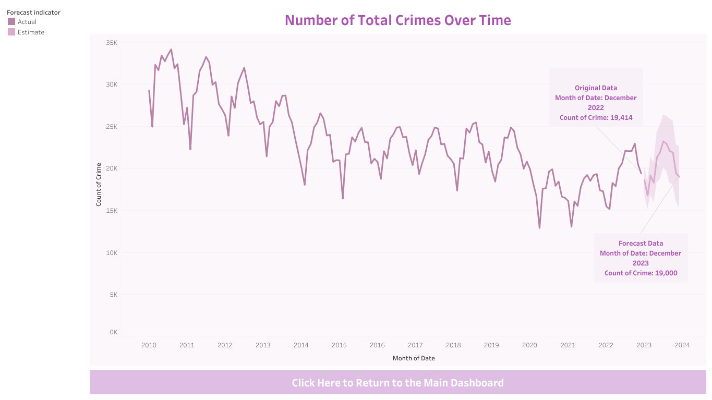

# Chicago_Crime_Analysis

- Author : Shehani Wetthasinghe
- Last modified: 02/17/2023

Source: Chicago Data Portal (https://data.cityofchicago.org/Public-Safety/Crimes-2001-to-Present/ijzp-q8t2)

## Overview
In this project the crime data in the city of Chicago (2010 - present) were analysed. The purpose of this project is to demonstrate my skills in Tableau

Link to Tablaue Public: https://public.tableau.com/app/profile/shehani.wetthasinghe/viz/ChicagoCrimeAnalysis_from2010/MainDashboard?publish=yes
 

